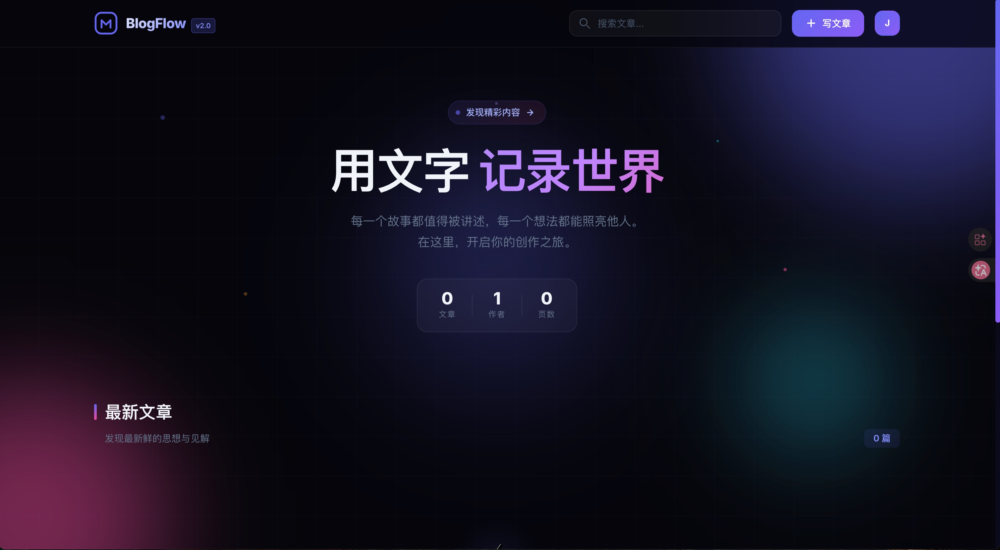
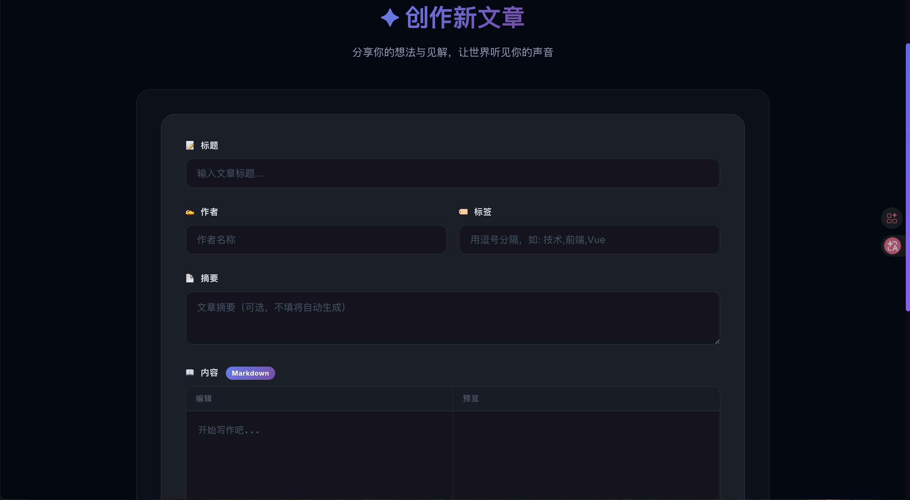

<div align="center">
  <br />
  
  
  
  
  <br />
  <br />

  <h1>✨ BlogFlow</h1>
  
  <p>
    <strong>一款全栈内容发布系统</strong>
    <br />
    惊艳的暗色科幻主题 · 双栏 Markdown 编辑器 · JWT 多用户认证
  </p>

  <p>
    <a href="#-技术栈">技术栈</a> ·
    <a href="#-功能特性">功能特性</a> ·
    <a href="#-快速开始">快速开始</a> ·
    <a href="#-API-文档">API 文档</a> ·
    <a href="#-项目结构">项目结构</a>
  </p>

  <br />
</div>

---

## 📸 预览

<div align="center">
  
  <br />
  <em>首页 — 暗色科幻风文章卡片网格</em>
</div>

<br />

<div align="center">
  
  <br />
  <em>创作编辑器 — 双栏 Markdown 编辑器，左侧编辑右侧实时预览</em>
</div>

---

## 🚀 技术栈

### 前端

| 技术 | 用途 |
|------|------|
| **Vue 3** (Composition API + `<script setup>`) | 前端框架 |
| **TypeScript** | 类型安全 |
| **Vite 5** | 构建工具与开发服务器 |
| **Vue Router 4** | 前端路由（6 个页面） |
| **Axios** | HTTP 请求（含拦截器自动注入 token） |
| **Marked** | Markdown → HTML 实时渲染 |
| **github-markdown-css** | Markdown 预览样式基础 |
| **Pure CSS** | 无第三方 UI 框架，100% 自定义暗色科幻主题 |

### 后端

| 技术       | 用途                 |
| ---------- | -------------------- |
| **Go 1.26+**  | 后端语言             |
| **Gin 1.12**  | HTTP Web 框架        |
| **SQLite 3**  | 嵌入式数据库         |
| **JWT (HS256)** | 用户认证（72h 过期） |

---

## ✨ 功能特性

### 📝 内容管理
- **文章 CRUD** — 创建、阅读、编辑、删除文章
- **Markdown 编辑器** — 创作页面采用双栏分屏设计，左侧写 Markdown，右侧实时预览 HTML 渲染效果
- **文章搜索** — 按标题/内容关键词搜索
- **分页浏览** — 每页 9 篇文章，支持页码导航
- **标签系统** — 文章支持逗号分隔的多标签

### 🔐 用户系统
- **注册 / 登录** — 邮箱 + 密码注册，JWT 无状态认证
- **修改密码** — 下拉菜单中修改密码，需验证原密码
- **自动作者分配** — 登录用户的文章自动标记为本人
- **72 小时登录持久化** — Token 存储在 localStorage，刷新不丢失

### 🎨 设计特色
- **暗色科幻空间主题** (`#05050a` 背景)
- **动态氛围背景** — 浮动光晕、粒子效果、网格纹理
- **毛玻璃效果** (`backdrop-filter: blur()`) — 卡片、导航栏、模态框
- **微交互** — 悬停发光、缩放过渡、平滑页面切换、骨架屏加载
- **完全响应式** — 适配桌面端、平板、手机

---

## 🛠️ 快速开始

### 前置要求

- [Go](https://go.dev/dl/) 1.26+
- [Node.js](https://nodejs.org/) 18+
- 一个终端（或两个，分别运行前后端）

### 1. 克隆项目

```bash
git clone https://github.com/your-username/blogflow.git
cd blogflow
```

### 2. 启动后端

```bash
cd backend
go build -o blog-server .
./blog-server
```

后端默认运行在 **http://localhost:8080**，SQLite 数据库文件自动创建在 `backend/blog.db`。

### 3. 启动前端

新开一个终端：

```bash
cd frontend
npm install
npm run dev
```

前端开发服务器运行在 **http://localhost:3001**，Vite 自动将 `/api` 请求代理到后端 `8080` 端口。

### 4. 开始使用

1. 打开 http://localhost:3001
2. 点击右上角 **注册** 创建一个账户
3. 登录后点击右上角 **写文章** 开始创作
4. 在文章编辑器中使用 **Markdown** 语法，右侧实时预览

---

## 🔌 API 文档

所有 API 端点统一通过 `/api` 前缀访问。

### 文章接口

| 方法 | 路径 | 认证 | 说明 |
|------|------|------|------|
| `GET` | `/api/articles` | 否 | 获取文章列表（支持 `page`、`page_size`、`search` 参数） |
| `GET` | `/api/articles/:id` | 否 | 获取单篇文章详情 |
| `POST` | `/api/articles` | 否 | 创建文章（若已认证则自动分配作者） |
| `PUT` | `/api/articles/:id` | 否 | 更新文章 |
| `DELETE` | `/api/articles/:id` | 否 | 删除文章 |

**查询参数示例：**

```
GET /api/articles?page=1&page_size=9&search=Vue
```

### 认证接口

| 方法 | 路径 | 认证 | 说明 |
|------|------|------|------|
| `POST` | `/api/auth/register` | 否 | 注册新用户（`username`, `email`, `password`） |
| `POST` | `/api/auth/login` | 否 | 登录（`email`, `password`），返回 JWT |
| `GET` | `/api/auth/me` | 是 | 获取当前登录用户信息 |
| `PUT` | `/api/auth/change-password` | 是 | 修改密码（`old_password`, `new_password`） |

> 认证方式：在请求头中添加 `Authorization: Bearer <token>`

---

## 📁 项目结构

```
blogflow/
├── backend/                   # Go 后端
│   ├── main.go                # 服务入口、CORS、路由注册
│   ├── database.go            # SQLite 初始化、建表、模型定义、密码哈希
│   ├── auth.go                # JWT 认证、注册/登录/改密处理器
│   ├── handlers.go            # 文章 CRUD 处理器
│   ├── go.mod / go.sum        # Go 模块依赖
│   └── blog.db                # SQLite 数据库文件（自动生成）
│
├── frontend/                  # Vue 3 前端
│   ├── src/
│   │   ├── main.ts            # 应用入口、全局 CSS 导入
│   │   ├── App.vue            # 根组件（路由视图 + 页面过渡动画）
│   │   ├── style.css          # 全局样式（重置、滚动条、工具类）
│   │   ├── api/
│   │   │   └── index.ts       # Axios 实例、请求/响应拦截器、API 方法
│   │   ├── router/
│   │   │   └── index.ts       # Vue Router 配置（6 个路由）
│   │   ├── types/
│   │   │   └── index.ts       # TypeScript 类型定义
│   │   └── views/
│   │       ├── HomeView.vue        # 首页（英雄区 + 文章网格 + 搜索 + 分页）
│   │       ├── ArticleDetail.vue   # 文章详情页（Markdown 渲染）
│   │       ├── CreateArticle.vue   # 创建文章（双栏 Markdown 编辑器）
│   │       ├── EditArticle.vue     # 编辑文章（双栏 Markdown 编辑器）
│   │       ├── LoginView.vue       # 登录页（霓虹暗色主题）
│   │       └── RegisterView.vue    # 注册页（双面板品牌展示）
│   ├── index.html              # HTML 入口
│   ├── vite.config.ts          # Vite 配置（端口 3001 + API 代理）
│   ├── package.json            # 前端依赖
│   └── tsconfig*.json          # TypeScript 配置
│
├── README.md                   # 本文件
└── .gitignore
```

---

## 🗄️ 数据库结构

```sql
CREATE TABLE articles (
    id         INTEGER PRIMARY KEY AUTOINCREMENT,
    title      TEXT NOT NULL,
    content    TEXT NOT NULL,
    summary    TEXT DEFAULT '',
    author     TEXT DEFAULT 'Anonymous',
    tags       TEXT DEFAULT '',
    cover_url  TEXT DEFAULT '',
    created_at DATETIME DEFAULT CURRENT_TIMESTAMP,
    updated_at DATETIME DEFAULT CURRENT_TIMESTAMP
);

CREATE TABLE users (
    id         INTEGER PRIMARY KEY AUTOINCREMENT,
    username   TEXT UNIQUE NOT NULL,
    email      TEXT UNIQUE NOT NULL,
    password   TEXT NOT NULL,           -- SHA-256 哈希
    avatar     TEXT DEFAULT '',
    bio        TEXT DEFAULT '',
    created_at DATETIME DEFAULT CURRENT_TIMESTAMP,
    updated_at DATETIME DEFAULT CURRENT_TIMESTAMP
);
```

---

## 🧪 本地开发建议

```bash
# 终端 1 - 后端（热重载需要额外工具）
cd backend
go run .

# 终端 2 - 前端（Vite 自带 HMR）
cd frontend
npm run dev
```

### 生产构建

```bash
# 前端构建
cd frontend
npm run build
# 产物在 frontend/dist/

# 后端构建
cd backend
go build -o blog-server .
```

---

## 🔒 安全说明

- 密码使用 **SHA-256** 哈希存储（建议生产环境升级为 bcrypt）
- JWT 密钥硬编码在 `auth.go` 中（生产环境建议通过环境变量注入）
- 文章接口当前未做权限校验（任何登录用户可编辑/删除任何文章）

---

## 🚧 下一步计划

- [ ] 密码哈希升级为 bcrypt
- [ ] 角色权限系统（Admin / Editor）
- [ ] 用户个人资料页（头像上传、个人简介编辑）
- [ ] 文章评论系统（嵌套评论）
- [ ] 图片上传接口 + CDN
- [ ] 深色/浅色主题切换
- [ ] 搜索防抖优化
- [ ] Docker Compose 一键部署
- [ ] 单元测试 + 集成测试

---

## 📄 许可证

[MIT](LICENSE)

---

<div align="center">
  <sub>Built with ❤️ using <strong>Vue 3</strong> + <strong>Go</strong> + <strong>SQLite</strong></sub>
</div>
